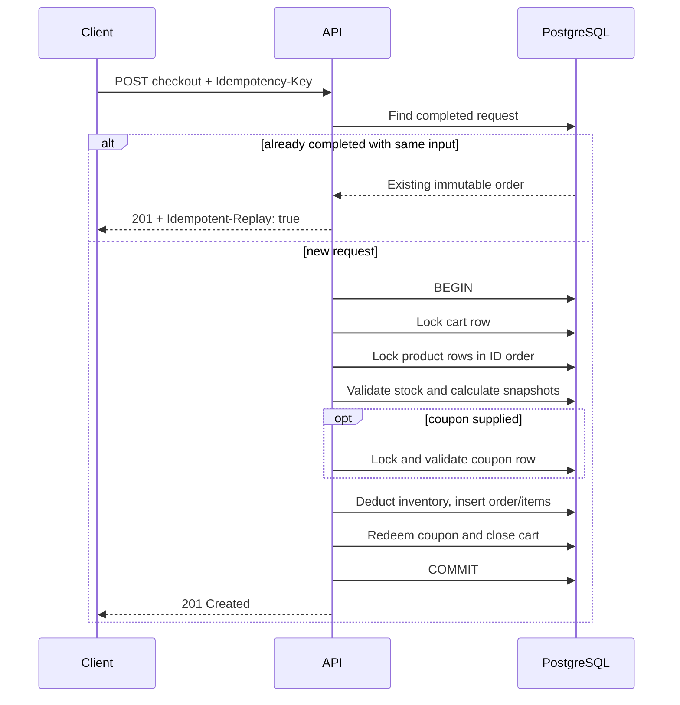

# Engineering Decisions

## System invariants

| Invariant | Enforcement |
|---|---|
| Inventory never becomes negative | Product rows are locked in ID order, availability is checked, and deduction occurs in the same transaction; the database also has `CHECK (inventory >= 0)`. |
| A cart creates at most one order | `orders.cart_id` is unique and the cart row is locked before its state transition. |
| A retry cannot create or charge twice | `orders.idempotency_key` is unique; concurrent waiters resolve to the committed order. A key reused with another cart or coupon is rejected. |
| An order remains explainable | Each order item snapshots product ID, name, unit price, quantity, and line total. Order totals have database consistency checks. |
| A milestone creates at most one coupon | `coupons.milestone_order_count` is unique and generation is serialized with a transaction-scoped PostgreSQL advisory lock. |
| A coupon redeems at most once | Its row is locked during checkout and `redeemed_order_id` is unique. Redemption is committed in the checkout transaction. |
| Failed checkout has no effects | Inventory, order, coupon, and cart changes share one transaction and roll back together. |
| Reports reconcile at one point in time | All report queries run in a read-only, repeatable-read transaction. |
| Concurrent replicas initialize the schema safely | Migration runners acquire a transaction-scoped PostgreSQL advisory lock before bootstrap DDL and re-check applied versions while holding it. |

## Checkout transaction

Every checkout locks resources in the same order to reduce deadlock risk.

## Selected semantics for ambiguities

- Cart items do not reserve inventory. Requests above current stock are rejected when a cart changes for early feedback, but availability is revalidated authoritatively at checkout.
- Cart views use current prices; checkout uses the current price under lock; the resulting order snapshots it forever.
- `POST` adds a product once and returns `ITEM_ALREADY_EXISTS` if repeated. `PUT` replaces its quantity. Quantity zero is invalid; `DELETE` removes an item.
- Coupon generation is manual. Each request creates at most one coupon for the oldest reached but unrewarded milestone.
- Coupons have no expiry, are not customer-bound, and apply to the whole subtotal.
- `n` and `x` are deployment configuration. Existing coupons retain the percentage with which they were generated.
- A retry with the same key, cart, and coupon returns the original order. Reusing that key with different input is a conflict.
- Empty-cart checkout is a semantic validation error (`422`); conflicting state such as exhausted stock or redeemed coupon is `409`.

## Decision: PostgreSQL transactions as the consistency boundary

**Context:** Inventory, orders, coupons, and cart state must remain consistent under overlapping requests and process failures.

**Options considered:** An in-memory mutex-based repository; optimistic compare-and-swap updates; PostgreSQL row locks and transactions.

**Choice:** Use one PostgreSQL transaction and pessimistic row locks for checkout.

**Why:** The database is the shared consistency boundary across goroutines and future application replicas. Row locks make the small critical section easy to explain, while sorted product locking gives all checkouts a stable lock order.

**Consequences:** Correctness does not depend on process-local state. A hot product can serialize competing checkouts, which is the intended trade-off for this workload. Higher scale might use atomic conditional updates plus bounded serialization retries.

## Decision: Database-backed idempotency

**Context:** A client may retry before it knows whether checkout committed, including while the first request is still running.

**Options considered:** Process-local request cache; cart ID alone; a client-supplied key with a database uniqueness constraint.

**Choice:** Require a globally unique `Idempotency-Key`, persist it on the order, and bind successful replay to the same cart and coupon.

**Why:** A local cache fails after restart and across replicas. Cart uniqueness prevents duplicate orders but cannot distinguish a retry from a new invalid attempt. The persisted key provides a stable answer.

**Consequences:** Clients must generate and retain keys. This implementation stores completed outcomes only; a production payment workflow would use a separate idempotency record with `in_progress`, `completed`, and recoverable failure states.

## Decision: Current price at checkout, immutable order snapshots

**Context:** Price can change between adding an item and checkout, while historical orders must remain explainable.

**Options considered:** Reserve price on add; reject if price changed; use current price at checkout.

**Choice:** Cart totals are estimates using current catalog prices. Checkout locks products, uses their then-current price, and stores a complete line snapshot.

**Why:** No reservation expiry mechanism is required and historical correctness does not depend on mutable product rows.

**Consequences:** A customer can see a changed total at checkout. A production UI should display this policy and could add price-version confirmation if product requirements demand explicit consent.

## Decision: Integer cents and explicit rounding

**Context:** Binary floating point can make totals and reports disagree.

**Options considered:** `float64`; PostgreSQL `numeric`; integer minor units.

**Choice:** Store and calculate USD values in signed 64-bit cents. Percentage discounts round half up to the nearest cent with `(subtotal * percent + 50) / 100`, then cap at the subtotal.

**Why:** Integer arithmetic is deterministic across Go and PostgreSQL and is easy to assert in tests.

**Consequences:** The model is intentionally single-currency and assumes a two-decimal currency. Multi-currency support would add an ISO currency per price/order and currency-specific minor-unit rules.

## Decision: Manual, serialized milestone generation

**Context:** Repeated or concurrent administrator calls must not reward a milestone twice, and more than one milestone may be outstanding.

**Options considered:** Generate automatically in checkout; use only a unique constraint and retry; serialize the administrator operation.

**Choice:** The admin endpoint selects the oldest eligible ungenerated milestone while holding a transaction-scoped advisory lock. A unique constraint remains the final guard.

**Why:** It matches the explicitly requested administrator action, gives deterministic catch-up behavior, and works across application replicas without a singleton table.

**Consequences:** Generating many accumulated rewards requires repeated calls. A batch limit could be added without changing the invariant.

## Decision: Stable machine-readable errors

**Context:** API clients need to distinguish missing resources, invalid input, and state conflicts without parsing prose.

**Options considered:** Plain strings; HTTP status alone; an error envelope with stable codes.

**Choice:** Return `{error: {code, message}}`, map validation to `400`/`422`, absence to `404`, conflicts to `409`, and unexpected failures to a non-revealing `500`.

**Why:** Codes form a small client contract while messages remain useful to humans. Internal database details are logged rather than exposed.

**Consequences:** New domain errors require an explicit mapping. A larger service could add field-level details, correlation IDs, and a generated error catalog.

## Decision: Serialize embedded migrations before bootstrap DDL

**Context:** Every application instance runs embedded migrations at startup, including when several replicas start together against a fresh database. `CREATE TABLE IF NOT EXISTS` does not serialize PostgreSQL catalog changes and concurrent bootstrap attempts can still fail with a uniqueness violation in the system catalog.

**Options considered:** Require an external deployment job immediately; use a session lock around per-file transactions; run the migration set in one transaction protected by a transaction-scoped advisory lock.

**Choice:** Acquire a transaction-scoped advisory lock before creating `schema_migrations`, then check and apply all pending embedded migrations in that transaction.

**Why:** The lock is released automatically on commit, rollback, connection failure, or process termination. Waiting replicas re-check migration state only after the winning runner commits, so they do not execute the same DDL.

**Consequences:** Application startup waits while another instance migrates, and the full migration set shares one transaction. A production deployment job remains preferable for operational control, especially once migrations become long-running or require non-transactional PostgreSQL operations.

## Implemented and intentionally deferred

Implemented: all required cart operations, product listing, atomic and idempotent checkout, order retrieval, manual coupon generation, coupon redemption, repeatable-read reporting, serialized embedded migrations and seeds, structured errors/logging, graceful shutdown, health checking, Docker Compose, executable examples, OpenAPI documentation, handler contract tests, real PostgreSQL concurrency tests, and a repeatable critical-path HTTP load harness.

Deferred deliberately:

- authentication and authorization, as permitted by the brief;
- real payment processing—the transaction treats successful checkout as payment success;
- product administration, reservation expiry, tax, shipping, multiple currencies, and coupon expiry/customer ownership;
- migration tooling with down migrations and checksum validation;
- metrics, distributed tracing, rate limits, and deployment manifests;
- durable payment/outbox orchestration, which is unnecessary without external side effects.

## Multiple instances and production evolution

The correctness mechanisms already reside in PostgreSQL, so multiple stateless API instances can share the database without a process-local lock. Checkout and coupon generation use database row/advisory locks, and simultaneous startup migration runners are serialized by a separate database advisory lock. All instances must use identical coupon configuration. Production hardening would add a connection proxy where appropriate, move migration execution to a deployment job for operational control, add TLS and secret-managed database credentials, authenticate admin routes, add request correlation and observability, retry bounded serialization/deadlock failures, maintain backups, and load-test hot inventory rows.

If payment or notifications become external side effects, checkout should become a state machine. A durable idempotency record would claim the request, payment would use the same external idempotency key, and an outbox written with the order would drive notifications. Database locks should never be held across a network payment call.

## AI-assisted development

AI-assisted coding and review tools were used to accelerate scaffolding, enumerate failure cases, and critique the transaction design. Every produced path was compiled, vetted, and tested against PostgreSQL.

One material correction came from reviewing the initial idempotency flow: two concurrent retries could both miss the first lookup; the loser then waited for the cart lock and could incorrectly receive `CART_ALREADY_CHECKED_OUT`. The flow was redirected to re-read the completed order after that lock race, and an eight-way concurrent regression test now proves one order is returned to every exact retry while inventory changes once. Review then exposed the related mismatched-input race: the post-lock lookup returned `CART_ALREADY_CHECKED_OUT` when the same key raced with a different coupon. That path now consistently returns `IDEMPOTENCY_KEY_REUSED`, with a concurrent regression test. Review also reproduced simultaneous startup failures in PostgreSQL catalog DDL and redirected migration startup to acquire its advisory lock before bootstrap.

No private prompts or transcripts are included.

## If given another two hours

First, I would add migration checksum validation and inspect PostgreSQL query plans plus lock-wait metrics under a longer, externally hosted load profile. I would also property-test money calculations near integer boundaries and fuzz request decoding. Those checks are more likely to reveal meaningful weaknesses than adding optional frontend surface area.
