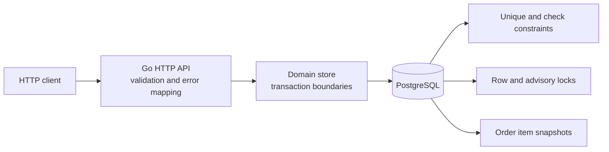

# Reliable Checkout and Rewards Service

A Go and PostgreSQL service built around four correctness properties: inventory cannot be oversold, a cart produces at most one order, retried checkout is idempotent, and a coupon is generated and redeemed at most once.

## Five-minute review

Requirements: Docker with Compose, plus `go`, `curl`, and `jq` for local checks.

```bash
docker compose up --build
```

In another terminal:

```bash
curl http://localhost:8080/health
make demo
make reviewer-check
```

`make reviewer-check` runs formatting, vetting, unit tests, then starts an isolated PostgreSQL test container on port 5433 and runs the real concurrency suite. It does not modify the development database.

Stop the service with `docker compose down`. Add `-v` only if you intentionally want to discard local development data.

## Architecture



The service is deliberately a modular monolith. HTTP concerns live in `internal/api`, persistence and business transactions in `internal/store`, and schema ownership in embedded migrations. This keeps the critical checkout path visible in one place while leaving clear seams for extraction if scale requires it.

## API

Money is represented as integer US cents. All error responses use:

```json
{"error":{"code":"INSUFFICIENT_INVENTORY","message":"product 5 has 2 units available but 3 were requested"}}
```

| Method | Path | Success | Purpose |
|---|---|---:|---|
| `GET` | `/health` | 200 | Process and database readiness |
| `GET` | `/products` | 200 | List seeded products and current inventory |
| `POST` | `/carts` | 201 | Create an empty cart |
| `GET` | `/carts/{cartID}` | 200 | View current prices and calculated subtotal |
| `POST` | `/carts/{cartID}/items` | 201 | Add `{product_id, quantity}`; conflicts if already present |
| `PUT` | `/carts/{cartID}/items/{productID}` | 200 | Replace quantity with `{quantity}` |
| `DELETE` | `/carts/{cartID}/items/{productID}` | 204 | Remove an item |
| `POST` | `/carts/{cartID}/checkout` | 201 | Checkout with required `Idempotency-Key` and optional `{coupon_code}` |
| `GET` | `/orders/{orderID}` | 200 | Retrieve the immutable purchase snapshot |
| `POST` | `/admin/coupons` | 201 | Generate one coupon for the oldest eligible milestone |
| `GET` | `/admin/report` | 200 | Return a consistent, non-mutating business report |

The two `/admin` operations are intentionally identified as administrative but are unauthenticated, as allowed by the assignment. Full schemas, status codes, and examples are in [docs/openapi.yaml](docs/openapi.yaml).

Important error codes include `NOT_FOUND`, `ITEM_ALREADY_EXISTS`, `EMPTY_CART`, `CART_ALREADY_CHECKED_OUT`, `INSUFFICIENT_INVENTORY`, `IDEMPOTENCY_KEY_REUSED`, `COUPON_NOT_FOUND`, `COUPON_ALREADY_REDEEMED`, and `NO_ELIGIBLE_MILESTONE`. Validation errors are `400`, absence is `404`, an empty cart is `422`, and state conflicts are `409`.

## Configuration

| Variable | Default | Meaning |
|---|---|---|
| `HTTP_ADDR` | `:8080` | Listen address |
| `DATABASE_URL` | required | PostgreSQL connection URL |
| `COUPON_EVERY_N_ORDERS` | `5` | `n`: order interval for a reward milestone |
| `COUPON_DISCOUNT_PERCENT` | `10` | `x`: integer percentage discount, 1–100 |

The Compose configuration is ready to run. For a local process, copy `.env.example`, export the values, and use `make run`.

## Tests

```bash
make test              # fast unit tests
make test-integration  # isolated PostgreSQL plus concurrency tests
make reviewer-check    # fmt, vet, unit, and integration
```

The integration suite deliberately overlaps operations. It verifies:

- eight simultaneous retries return one order and deduct stock once;
- two carts competing for two remaining units produce one order, never an oversell;
- five simultaneous administrator requests generate one coupon for a milestone;
- a failed checkout does not consume its coupon;
- two simultaneous checkouts cannot both redeem one coupon;
- an idempotency key cannot be reused with a different cart or coupon; and
- an order retains its original product name and price after the catalog changes.

Fast handler tests separately verify strict JSON parsing, required idempotency keys, replay headers, resource locations, and the documented status/error-code mapping.

## Repository map

```text
cmd/api/                  process startup and graceful shutdown
internal/api/             routes, JSON validation, status/error contract
internal/config/          environment configuration
internal/database/        pool, embedded migration, seed data
internal/domain/          response models
internal/store/           transactions and reporting queries
docs/openapi.yaml         complete HTTP contract
scripts/demo.sh           executable reviewer walkthrough
DECISIONS.md              invariants, trade-offs, and deferred work
WORKLOG.md                actual implementation-time record
```

Start with [DECISIONS.md](DECISIONS.md) for the reasoning behind the transaction, idempotency, money, coupon, and scaling choices.

## Time spent

The measured implementation session and the method used to record it are in [WORKLOG.md](WORKLOG.md). The current total is approximately 21 minutes; candidate review or later changes should be appended before submission.
